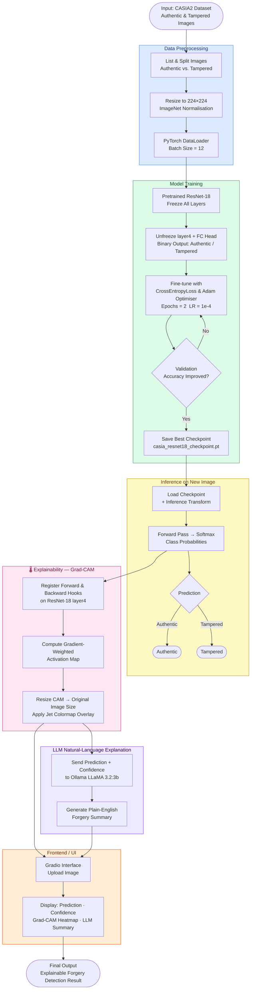

# An Explainable AI Approach for Deepfake Detection on ForgeryNet

A deep-learning pipeline that detects image forgeries using a fine-tuned **ResNet-18** model trained on the **CASIA2** dataset, and explains *where* the forgery occurs with **Grad-CAM** heatmaps and an **LLM-generated** natural-language summary.

---

##  Project Flow Diagram



---

##  Key Components

| Component | Details |
|-----------|---------|
| **Dataset** | [CASIA2](https://github.com/namtpham/casia2groundtruth) – Authentic & Tampered image pairs |
| **Model** | ResNet-18 (ImageNet pre-trained), fine-tuned for binary forgery classification |
| **XAI Method** | Grad-CAM on `layer4` — highlights manipulated regions |
| **LLM Explanation** | Ollama · LLaMA 3.2:3b — generates plain-English forgery description |
| **UI** | Gradio web interface embedded in `xai_frontend.html` |
| **Checkpoint** | `casia_resnet18_checkpoint.pt` / `casia_resnet18_forgery.pth` |

---

##  Quick Start

### 1. Install Dependencies
```bash
pip install torch torchvision scikit-learn matplotlib pillow gradio opencv-python
```

### 2. (Optional) Start Ollama for LLM Explanations
```bash
ollama serve
ollama pull llama3.2:3b
```

### 3. Run the Notebook
Open `implementation.ipynb` in Jupyter and run all cells top-to-bottom.  
The last cell launches the **Gradio** app at `http://127.0.0.1:7860`.

### 4. Open the Frontend
Open `xai_frontend.html` in your browser — it embeds the Gradio app in a clean UI.

---

##  Repository Structure

```
.
├── implementation.ipynb          # Full training + inference + XAI + Gradio pipeline
├── xai_frontend.html             # Standalone HTML frontend for the Gradio app
├── casia_resnet18_checkpoint.pt  # Saved model checkpoint (state dict + metadata)
├── casia_resnet18_forgery.pth    # Alternative saved model weights
├── public_images_predictions.csv # Predictions on public test images
└── README.md                     # This file
```

---

##  Pipeline Summary

1. **Data Loading** — Scans `CASIA2/Au` (authentic) and `CASIA2/Tp` (tampered) folders.
2. **Preprocessing** — Resize → Normalize (ImageNet stats) → DataLoader.
3. **Fine-Tuning** — Freeze backbone, unfreeze `layer4` + FC head, train 2 epochs.
4. **Checkpointing** — Best validation-accuracy model is saved.
5. **Inference** — Load checkpoint, run image through model, get class + confidence.
6. **Grad-CAM** — Hooks on `layer4` produce a saliency heatmap over the image.
7. **LLM Summary** — Prediction + confidence sent to LLaMA 3.2 for a plain-English explanation.
8. **Gradio UI** — Single-page interface: upload → see prediction, heatmap, and text explanation.
